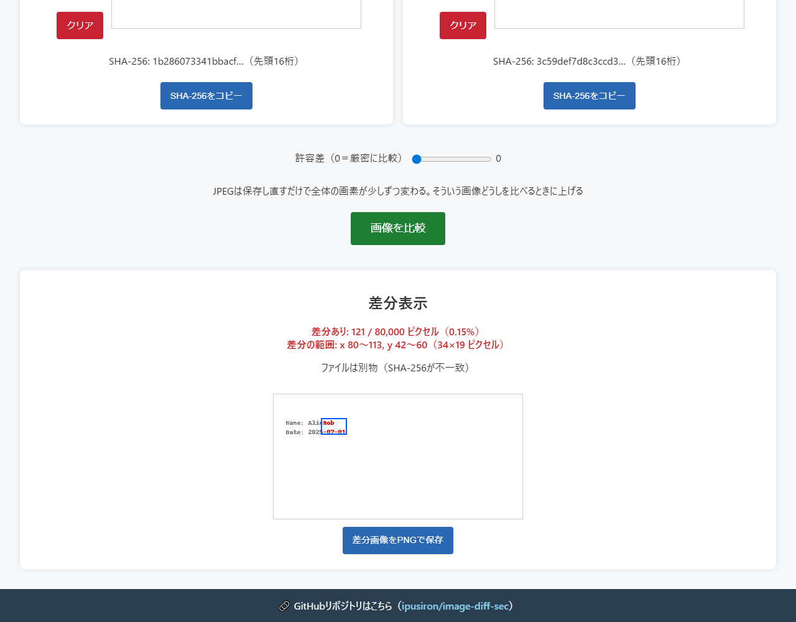
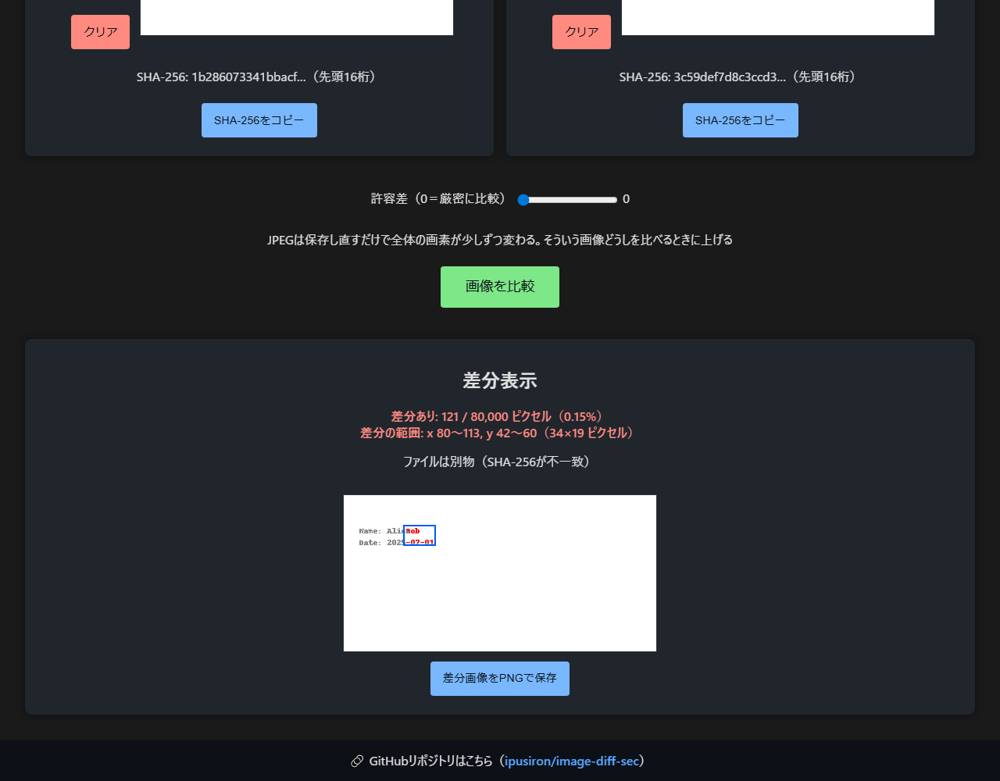
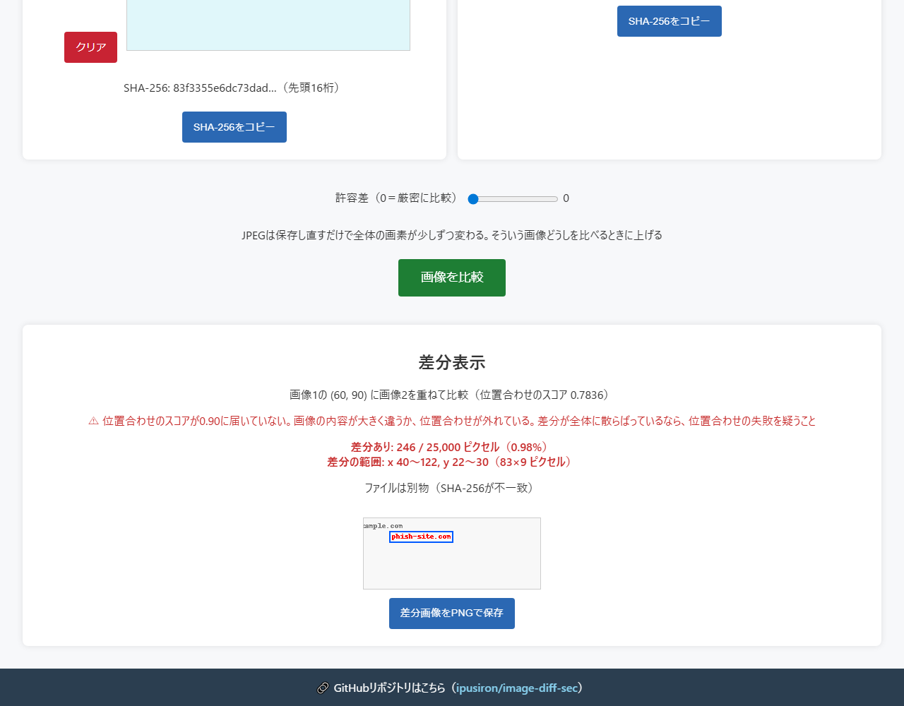

# ImageDiffSec - Pixel-level Image Difference Detection Tool

English · [日本語](README.md)


[](https://ipusiron.github.io/image-diff-sec/)

**Day021 - 100 Security Tools with Generative AI**

**ImageDiffSec** compares two images pixel by pixel and shows you where they differ.

It is aimed at security work: checking whether a QR code has been swapped, or finding the edited region of an
image submitted as evidence.

---

## 🌐 Demo

👉 [https://ipusiron.github.io/image-diff-sec/](https://ipusiron.github.io/image-diff-sec/)

---

## 📸 Screenshots

The screenshots are taken from the running tool with the Japanese interface.


> *121 differing pixels in a document, with the area they cover. SHA-256 also shows that the files differ.*


> *The same comparison in dark mode. Differences are red, the bounding box is blue.*


> *A crop of a flyer placed at (60, 90). The 0.7836 score warning and 246 differing pixels are shown.*

---

## ✨ Features

- Load two images and compare them
- Highlight every differing pixel in red
- Show the raw count, the rate and the area of the difference. Even a single pixel reads as a difference
- When the sizes differ, locate the smaller image inside the larger one
- A tolerance slider ignores small color shifts and re-compares without redoing the alignment
- Show and copy the SHA-256 of the original file to check whether the files themselves are identical
- Save a PNG with the red difference and the blue bounding box
- Drag & drop, keyboard operation, light and dark themes
- Japanese and English interface. Switching the language never clears a result or a notice on screen

---

## 🔐 Intended use cases

Ways of using this tool in particular

- Showing a difference in content with numbers even when the look is the same (tamper-detection and visualization classes): comparing two indistinguishable QR codes (`qr_legit.png` and `qr_fake.png`, 330x330) pixel by pixel reports 16,900 of 108,900 pixels, 15.52% of the whole, as different. You can show, with a rate and red highlighting, a difference in internal structure that the eye cannot catch
- Boxing where a small edit is (document verification and localized diff): for `doc_original.png` and `doc_edited.png` (400x200), where only part of the document was changed, only 121 of 80,000 pixels differ, 0.15%. Even so, the changed area fits in a 34x19 box from (80,42) to (113,60). You can confirm at once how small the difference is and the box around the change
- Ignoring noise with a tolerance (image-processing and threshold classes): pixel comparison has a tolerance, and pixels whose color difference is within the tolerance are not counted as different. When one channel of one pixel differs by 5, a tolerance of 0 or 4 counts 1 pixel as a difference, but a tolerance of 5 counts 0. You can confirm the idea of counting only meaningful changes while ignoring the slight noise of lossy compression

| Security application | Description |
|---|---|
| Checking a tampered QR code | Compare two QR codes that look the same but carry different data |
| Checking a tampered evidence image | Reveal small edits in a social media image or a screenshot |
| Detecting a corrected document | Look for retouching in a scanned document |

---

## 🔐 Where a pixel comparison helps

An image can look unchanged while the pixels tell another story. **ImageDiffSec** makes that visible quickly.

### 📌 Checking a tampered QR code

Two QR codes can look alike and still hold different URLs. A fake code may point at `https://examp1e.com`
instead of the legitimate `https://example.com`. A pixel comparison makes that internal difference visible at once,
which is enough to start suspecting tampering.

### 📌 Checking the authenticity of a submitted image

Sometimes you need to know whether a submitted image matches the original: a receipt, a signed contract, a
photograph of an accident site. A small edit to a name, an amount or a timestamp shows up in red.

### 📌 Detecting a manipulated public image

Press photographs and surveillance footage can be edited on purpose. Added smoke or fire, a removed or composited
person: the difference view shows edits the eye tends to miss. This is useful in the early stage of OSINT analysis
and fake news verification.

**ImageDiffSec** is meant as the first move of such a check, a way to see quickly that something is off.

---

## 📖 How to use

1. Load two images with the "Choose a file" buttons, or by dragging and dropping them
2. Press "Compare images". The result appears below
3. Read the raw count, the area and the red difference. With different sizes, also read the position and the score
4. Change the tolerance if you need to, and press "Save the difference as PNG" to keep the result

When the sizes differ, the smaller image has to fit inside the larger one. Use the clear buttons to swap an image.

---

## 📊 Reading the result

The raw count comes first. "No difference" appears only when zero pixels differ. A single differing pixel already
reads as "Difference found".

| Situation | Example output |
|---|---|
| Two identical document images | No difference: all 80,000 pixels match |
| A name and a date edited in a document | Difference found: 121 / 80,000 pixels (0.15%) |
| One pixel changed out of a million | Difference found: 1 / 1,000,000 pixels (under 0.01%) |

The rate is "differing pixels ÷ compared pixels × 100". With different sizes, only the aligned overlapping area
counts as the denominator.

**A small rate does not mean the image is safe.** A digit of an amount or a character of a date fits in a few dozen
pixels. In a one-megapixel image, anything up to 99 differing pixels is reported as "under 0.01%". Read the raw
count and the area, not only the rate.

### SHA-256 and matching pixels are two different facts

SHA-256 is computed over the bytes of the file you loaded. The first 16 hex digits are shown; all 64 are available
from the title of the hash line and from the copy button. Matching pixels with a different SHA-256 mean that only
metadata (such as Exif) or the compression settings differ. When SHA-256 cannot be computed, the pixel comparison
still works.

### When to raise the tolerance

Re-saving a JPEG alone shifts every pixel slightly, and a tolerance of 0 can turn the whole image red. A higher
tolerance ignores small color shifts, but it can also hide a real edit. A result obtained with a non-zero tolerance
states the condition, as in "(compared with tolerance 10)".

---

## ⚙️ Algorithm

Equal sizes and different sizes share the same pixel comparison. The alignment score never changes the yardstick.

### Images of the same size

Each RGBA component of the corresponding pixels is compared, and a pixel counts as different when
`max(|dR|, |dG|, |dB|, |dA|) > tolerance`. A difference in alpha alone counts too. The tolerance defaults to 0 and
ranges from 0 to 255.

Differences are drawn in red (255,0,0). The other pixels are averaged to gray and pushed 50% towards white, and a
blue (0,90,255) box 2px wide is drawn 3px outside the difference area. At the border only the visible part is drawn.

### Images of different sizes

The position is found by normalized cross-correlation (NCC) over a pyramid of reduced images.

1. Build block-averaged reductions at power-of-two factors
2. Search every position at the coarsest level, merge nearby candidates and keep the best five
3. Step down a level and search ±3px around each candidate coordinate doubled
4. Take the best candidate at the original resolution and run the RGBA comparison there

Scores are only compared inside the same level. The statistics of the smaller image are computed once per level, and
the sums for each candidate are gathered in a single pass over the larger image. The browser gets a chance to paint
between levels, and the progress reads "Aligning… (2 / 4 levels)".

NCC absorbs uniform changes in brightness and contrast. Rotation and scaling are not supported: the smaller image
has to be a crop of the larger one **at the same size and orientation**.

---

## 🧭 Limits of the alignment

When the smaller image is a flat color (a crop of blank paper, for example) there is no clue to its position, and
no comparison is possible. In that case, and when the best score is 0, the tool reports that alignment is
impossible and shows no numbers.

An exhaustive survey over crops of the bundled samples gives the following. Each cell is "positions found correctly
/ positions tried".

| Sample | 0 informative pixels | 1-99 | 100 or more |
|---|---|---|---|
| doc (54 crops of 200×100) | 0 / 30 | 9 / 9 | 15 / 15 |
| flyer (63 crops of 250×100) | 0 / 22 | 4 / 9 | 32 / 32 |

An "informative pixel" is a pixel that is neither the background color nor different from the original. With 100 or
more of them, all 47 crops were located correctly. This is a survey over the bundled samples, not a guarantee for
images in general.

Tampering lowers the score. For the crops listed below, the position was still found correctly at 0.7836 (flyer),
0.7845 (doc) and 0.4386 (qr). A warning below 0.90 is not a verdict that the position is wrong. When the difference
is scattered over the whole image, suspect a failed alignment as well.

The browser converts color spaces and applies the Exif Orientation when it draws an image. What is compared is the
**pixels after drawing**. Use SHA-256 to check whether the file bytes match. Images larger than 4096px are scaled
down on load, so the comparison is no longer strict at the original resolution.

---

## 🔧 Technical notes

- **Stack**: HTML, CSS and vanilla JavaScript. Classic scripts plus conditional CommonJS share code with the tests
- **Accepted formats**: PNG, JPEG, GIF and WebP. SVG and others are rejected
- **Load size**: over 4096px in width or height, the image is scaled down with a floored aspect ratio, and both
  sizes are reported
- **Pixel comparison**: four RGBA components, tolerance 0-255. Equal sizes cost time proportional to the pixel count
- **Alignment**: multi-level NCC search, best five candidates, a warning below 0.90. Flat images and sizes without
  containment are reported instead of compared
- **Output**: raw count, rate, area, position and score, SHA-256, and the difference PNG
- **Interface language**: Japanese and English, chosen from `?lang=ja` / `?lang=en`, then the stored choice, then
  the browser setting. Every string lives in the dictionary in `js/i18n.js`, and the pure logic returns only
  `{ key, params }`
- **Memory and time**: the images and the reduced levels are held in the browser. Larger images and wider searches
  cost more time and memory
- **Verified**: in Chromium, a 1000×1000 original against a 500×500 crop, with four progress updates

---

## 🗂️ Sample images

The `samples/` folder holds dummy images for security checks. Compared with a tolerance of 0:

| Pair | Size | Differing pixels | Rate | Difference area |
|---|---|---|---|---|
| qr_legit.png and qr_fake.png | 330×330 | 16,900 / 108,900 | 15.52% | x 40-289, y 40-289 |
| doc_original.png and doc_edited.png | 400×200 | 121 / 80,000 | 0.15% | x 80-113, y 42-60 |
| flyer_before.png and flyer_after.png | 400×250 | 246 / 100,000 | 0.25% | x 100-182, y 112-120 |

**Neither the document nor the flyer reaches 0.3%. The rate does not measure how serious the tampering is.**

### Basic test images (same size)

| File | Contents |
|---|---|
| `qr_legit.png` | A legitimate QR code |
| `qr_fake.png` | A tampered QR code |
| `doc_original.png` | The original scan of a document |
| `doc_edited.png` | The same document with edited contents |
| `flyer_before.png` | An event flyer before correction |
| `flyer_after.png` | The flyer with an edited URL and wording |

### Testing images of different sizes

Use the generator pages to try the comparison of images with different sizes.

1. **QR code scenarios**: open `test-tools/qr-test-generator.html`
   - **Scenario 1**: full size vs a cropped version
   - **Scenario 2**: the same QR code on backgrounds of different sizes
   - **Scenario 3**: a tampering check
2. **Basic check**: open `test-tools/simple-test-generator.html`
   - **Test 1**: an exact match
   - **Test 2**: a tiny difference
   - **Test 3**: a complex pattern

#### Expected results

- **A crop with the same contents**: once aligned, "No difference: all N pixels match"
- **A crop with an edit**: "Difference found: N / M pixels" with the rate and the area, plus the alignment warning

The automated tests check the crops [50,20 200×100] of the document, [60,90 250×100] of the flyer and
[35,35 200×200] of the QR code, against both the original and the edited image. Against the original the difference
is 0; against the edited image it is 121, 246 and 11,200 pixels respectively.

---

## 🔒 Security

Images and hashes are processed inside the browser and never sent anywhere. Neither the app nor the two
test-tools pages loads an external resource, and the QR generator uses the bundled copy of qrcode-generator.

- **CSP**: scripts and styles from the same origin only. Images from the same origin, `blob:` and `data:` only.
  `connect-src`, `base-uri`, `form-action` and `object-src` are `none`
- **referrer**: `no-referrer`, so no referring page is sent
- **Input check**: only PNG, JPEG, GIF and WebP are accepted. A missing or unreadable image is reported on screen
- **Rendering**: results and messages use `textContent`. File contents are never executed as HTML
- **Links**: links that open a new tab carry `rel="noopener noreferrer"`
- **Storage**: only the theme and the interface language are kept in localStorage. Images and hashes are not stored

A CSP in a meta tag cannot set `frame-ancestors`, so clickjacking is not prevented. Set it as an HTTP response
header where the deployment needs it. The two test-tools pages are development generators: they keep their inline
script and style and carry no CSP.

---

## 🧪 Tests

Node 22 or later, with no dependencies to install.

```bash
npm test
```

GitHub Actions runs the same tests on every push and pull request. The fixed expectations cover 8 RGBA comparisons,
11 rate outputs, 7 synthetic patterns, the 6 bundled images and 6 crops. The sample table in the README is
recomputed from the image files, and the image references, the YAML block and the tree of every file are checked.
CSP, the purity of the core functions, the contrast of the palette, line length and the SHA-256 of the bundled
distribution are checked too. For the dictionaries, the tests check that Japanese and English hold the same keys and
the same placeholders, that every key used by the HTML and the scripts exists, that no Japanese is left in the
English dictionary, and that no state-dependent slot or attribute carries `data-i18n`.

---

## 🚧 Planned

This tool focuses on comparing images on the web. Related tools are planned as separate projects.

- 📸 **A spot-the-difference tool for printed material**
  Photograph a printed page with a phone or a webcam and compare it with the image, to find edits and typos in
  flyers, documents and notices.

- 🕵️‍♂️ **A dedicated steganography detector**
  Visual and statistical support for finding information hidden inside an image, such as concealed text or
  watermarks.

- 🧠 **A pHash (perceptual hash) comparison tool**
  Decide from high-dimensional features whether two files that look alike are the same picture.

Each will be released as its own Day entry of the "100 Security Tools with Generative AI" project.

---

## 📁 Directory structure

```text
image-diff-sec/                     # A tampering detector that compares two images pixel by pixel
├── .github/                        # GitHub settings
│   └── workflows/                  # GitHub Actions workflows
│       └── test.yml                # Runs npm test on push and pull_request
├── .gitignore                      # Paths excluded from Git
├── .nojekyll                       # Disables Jekyll processing on Pages
├── assets/                         # Images for the README and the site icon
│   ├── favicon.svg                 # Site icon (two overlapping images and a difference)
│   ├── screenshot2.png             # The document sample compared, light theme
│   ├── screenshot3.png             # The same state in the dark theme
│   └── screenshot4.png             # Two images of different sizes aligned and compared
├── CLAUDE.md                       # Development guide for AI
├── index.html                      # Markup of the screen
├── js/                             # Application scripts
│   ├── core/                       # Pure logic with no dependency on the screen
│   │   ├── hash.js                 # Hash bytes to a hex string
│   │   ├── pixel-diff.js           # Pixel comparison, area and the parts of the result text
│   │   └── template-match.js       # Alignment by a multi-level reduced search
│   ├── i18n.js                     # The Japanese and English strings and the language switch
│   ├── image-processor.js          # Loading, comparing and drawing the difference
│   ├── main.js                     # Wiring at startup
│   └── ui-controller.js            # Drop zones, theme, modal, language button, message area
├── LICENSE                         # The MIT license of this tool
├── package.json                    # The dependency-free npm test definition
├── README.en.md                    # This document
├── README.md                       # The Japanese document
├── samples/                        # Sample images for trying the tool
│   ├── doc_edited.png              # A document with edited contents (121 pixels)
│   ├── doc_original.png            # The original document
│   ├── flyer_after.png             # A flyer with edited wording (246 pixels)
│   ├── flyer_before.png            # The original flyer
│   ├── qr_fake.png                 # A swapped QR code (16,900 pixels)
│   └── qr_legit.png                # The legitimate QR code
├── style.css                       # The palette in CSS variables and the responsive layout
├── test/                           # Automated tests for node --test
│   ├── contrast.test.js            # Contrast between text and surface colors
│   ├── format.test.js              # Line length and readability
│   ├── html.test.js                # CSP, ARIA and the absence of external loads
│   ├── i18n.test.js                # Dictionaries, data-i18n and untranslated strings
│   ├── pixel-diff.test.js          # Pixel comparison and the parts of the result text
│   ├── readme.test.js              # Tables, images, the tree and the YAML block
│   ├── samples.test.js             # Differences, areas and SHA-256 of the bundled samples
│   ├── static.test.js              # Purity, no logging, CI and the bundled distribution
│   ├── support/                    # Helpers used only by the tests
│   │   ├── patterns.js             # Synthetic patterns for the alignment tests
│   │   └── png.js                  # A minimal PNG decoder for the tests
│   └── template-match.test.js      # The alignment
├── test-tools/                     # Generator pages for manual checks
│   ├── qr-test-generator.html      # Builds QR code test images
│   └── simple-test-generator.html  # Builds simple pattern test images
└── vendor/                         # Self-hosted distribution
    └── qrcode-generator/           # qrcode-generator 1.4.4 (used by test-tools only)
        ├── LICENSE                 # The MIT license of qrcode-generator
        └── qrcode.min.js           # The unmodified distribution
```

---

## 💻 Requirements

Any current browser with Canvas, Blob and Web Crypto. On this machine, Chromium loaded images over HTTP and from
`file://`, and the comparison, SHA-256 and PNG export all worked. From the first paint through the comparison there
were no CSP violations, no 404s and no console errors or warnings. Other browsers, and the decoding of every image
format, have not been verified.

To open it directly, open `index.html` in a browser. To serve it over local HTTP, run this at the repository root:

```bash
python -m http.server 8000 --bind 127.0.0.1
```

Then open `http://127.0.0.1:8000/`. This is not a server for sending images anywhere.

---

## 📄 License

MIT License. See [LICENSE](LICENSE) for the details. qrcode-generator 1.4.4 by Kazuhiko Arase, used by the
test-tools pages, is MIT licensed as well. Its license is at
[vendor/qrcode-generator/LICENSE](vendor/qrcode-generator/LICENSE), and the distribution is unmodified.

---

## 🛠️ About this tool

This tool was built as part of the "100 Security Tools with Generative AI" project, which releases a security
tool a day for 100 days with the help of AI.

🔗 [https://akademeia.info/?page_id=42163](https://akademeia.info/?page_id=42163)
