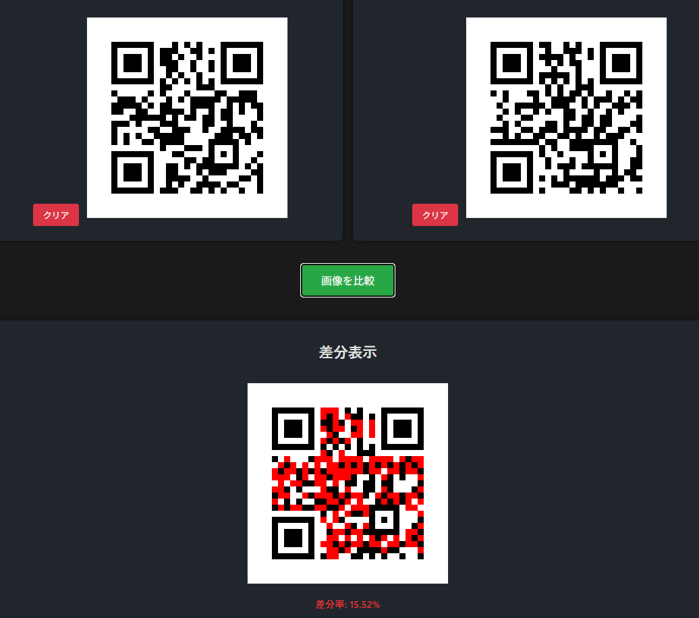

# ImageDiffSec - 2画像のピクセル差分検出ツール


**Day021 - 生成AIで作るセキュリティツール100**

**ImageDiffSec** は、2枚の画像をピクセル単位で比較し、視覚的な違いを視覚化するツールです。  
とくにセキュリティ分野において、QRコードの改ざん検出や証拠画像の検証などに活用できます。

---

## 🌐 デモページ

👉 [https://ipusiron.github.io/image-diff-sec/](https://ipusiron.github.io/image-diff-sec/)

---

## 📸 スクリーンショット

>   
> *QRコードの差分チェック*

---

## 🖼 主な機能

- 画像2枚をアップロードして差分を比較
- ピクセル単位の差分を赤色で強調表示
- 差分率（%）の自動表示
- モダンかつ直感的なUIで即座に操作可能

---

## 🔐 想定ユースケース

| セキュリティ応用            | 説明                                                                 |
|-----------------------------|----------------------------------------------------------------------|
| QRコード改ざんチェック      | 見た目が同じでも、内部データが異なるQRコードを比較検出              |
| 画像の証拠改ざんチェック    | SNS投稿画像やスクリーンショットに対する微細な変更を可視化           |
| ドキュメントの修正検知      | スキャン画像の修正・加工有無を調べる                                 |

---
## 🔐 セキュリティ的に有効なピクセル比較の活用例

画像の見た目は変わらなくても、ピクセルレベルでは重大な差異が存在することがあります。  
**ImageDiffSec** を用いることで、以下のようなセキュリティ上のリスクや改ざんを素早く検出できます。

---
### 📌 QRコードの改ざんチェック

QRコードは一見同じように見えても、埋め込まれたURLが異なる場合があります。  
たとえば、正規サイト `https://example.com` ではなく、フィッシングサイト `https://examp1e.com` に誘導する偽コードが使われることがあります。  
ピクセル比較を行えば、**外観が酷似していても内部構造の違いが即座に可視化** され、改ざんを疑うきっかけになります。

---
### 📌 証拠画像・提出画像の真正性チェック

SNS投稿や報告資料として提出された画像が、 **原本と一致しているかどうか** を検証したいケースがあります。  
たとえば、領収書・署名済み契約書・事故現場の記録写真などです。  
わずかな改変（氏名・金額・タイムスタンプの書き換え）も、ピクセル比較なら **変更箇所を赤く強調** して検出できます。

---
### 📌 公開画像のプロパガンダ・操作検出

報道写真や監視映像の一部が、 **意図的に加工・演出されている可能性** があります。  
煙や火、人物の削除・合成など、目視では気づきにくい改ざんも、ピクセル差分で確認できます。  
これは **OSINT（オープンソースインテリジェンス）** 分析や、 **フェイクニュース検証** の初期段階において有効です。

---

**ImageDiffSec** は、こうしたセキュリティ検証の **最初の一手** として、視覚的にすばやく違和感を見つけるためのツールとして機能します。

---

## 🧪 使用方法

1. ページを開き、左右の画像アップローダーで2枚の画像を読み込みます。
2. 差分が自動的に解析され、中央に差分画像が表示されます。
3. 差分率が下部に表示され、変更の有無が一目で分かります。

---

## 📊 差分率とは？

本ツールでは、2枚の画像の「異なるピクセルの割合」を **差分率（Difference Rate）** として表示します。

具体的には、次のように算出されます：

> 差分率（%） = 異なるピクセル数 ÷ 総ピクセル数 × 100

- 画像サイズが同じ場合のみ比較されます。
- ピクセル単位でRGB値が一致しない箇所を「差分」とみなします。
- 差分ピクセルは赤色でハイライトされます。

---
### 例

| 状況                                     | 差分率の例       |
|------------------------------------------|------------------|
| 完全に同じ画像（コピー）                | 0.00%            |
| 一部だけ改ざんされた画像（数文字変更）  | 0.05% ～ 2.00%   |
| 全体的に異なる画像                      | 30% ～ 100%      |

---
### 🛡 活用意図

この指標により、たとえ目視ではほとんど同じに見える画像でも、内部的にわずかな改ざんが加えられているかどうかを判定する助けとなります。

たとえば、QRコードや契約書画像の偽造チェックにおいて、差分率が1%を超えていれば、改ざんの可能性を疑う価値があります。

---
## 🗂 サンプル画像

本リポジトリの `samples/` フォルダーには、セキュリティ検証用のダミー画像が含まれています。

| ファイル名         | 内容                             |
|--------------------|----------------------------------|
| `qr_legit.png`     | 正常なQRコード                   |
| `qr_fake.png`      | 改ざんされたQRコード             |
| `doc_original.png` | 元の書類スキャン画像             |
| `doc_edited.png`   | 内容が変更された書類画像         |
| `flyer_before.png` | 修正前のイベント告知チラシ       |
| `flyer_after.png`  | URLや文言が改変されたチラシ画像 |

`samples/` フォルダー内の画像を使って、差分検出をお試しください。

---

## 📁 フォルダー構成

```
image-diff-sec/
├── index.html
├── style.css
├── script.js
├── assets/
│ └── screenshot.png
└── samples/
├── qr_legit.png
├── qr_fake.png
├── doc_original.png
├── doc_edited.png
├── flyer_before.png
└── flyer_after.png
```

---

## 📄 ライセンス

MIT License - 詳細は [LICENSE](LICENSE) を参照してください。

---

## 🧠 制作者メモ

- 本ツールは「画像比較 × セキュリティ可視化」というテーマで構築されました。
- 実装は1日で完結するように設計し、モダンでシンプルなUX/UIを重視しています。

---

## 🚧 今後の展望

本ツールはWeb上の画像比較に特化していますが、以下のような発展的なツールの開発も視野に入れています：

- 📸 **実物印刷物の間違い探しに対応したツール**  
  スマートフォンやWebカメラを用いて印刷物を撮影し、画像と比較することで、  
  チラシ・資料・掲示物などの改ざん・誤植を簡単に発見できるようにする予定です。

- 🕵️‍♂️ **ステガノグラフィ検出専用ツール**  
  画像内に秘匿された情報（隠しテキストや透かし）を発見するための、視覚支援・統計支援ツールを検討中です。

- 🧠 **pHash（perceptual hash）比較ツール**  
  見た目が似ているがファイルが異なる画像を、高次元の特徴量から判定する専用ツールも構想中です。

これらは別ツールとして独立して開発し、「生成AIで作るセキュリティツール100」プロジェクトの今後のDay項目で順次リリース予定です。

---

## 🛠 このツールについて

本ツールは、「生成AIで作るセキュリティツール100」プロジェクトの一環として開発されました。 このプロジェクトでは、AIの支援を活用しながら、セキュリティに関連するさまざまなツールを100日間にわたり制作・公開していく取り組みを行っています。

プロジェクトの詳細や他のツールについては、以下のページをご覧ください。

🔗 [https://akademeia.info/?page_id=42163](https://akademeia.info/?page_id=42163)
