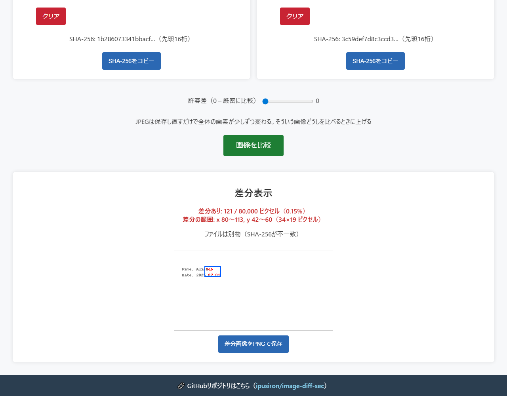
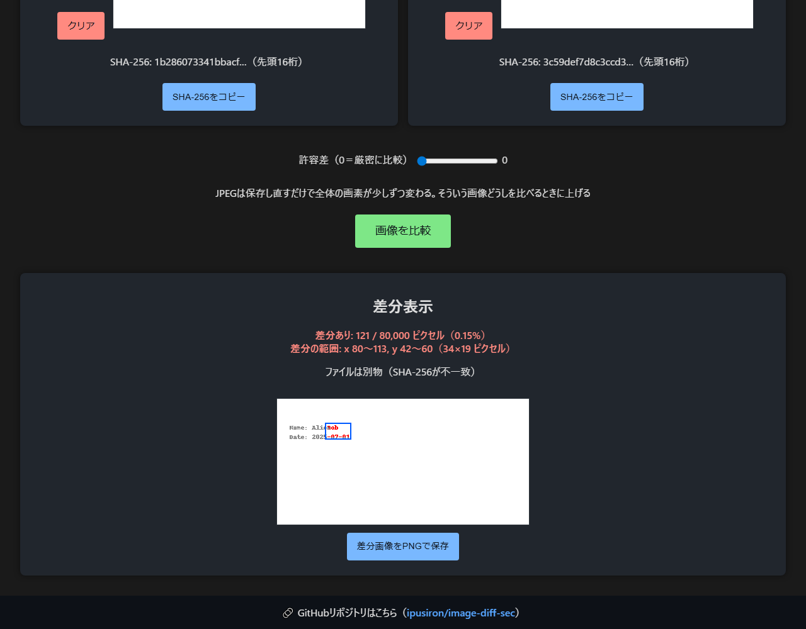
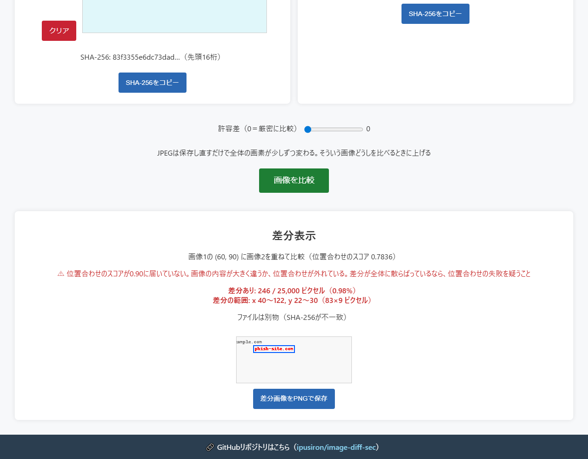

<!--
---
id: day021
slug: image-diff-sec

title: "ImageDiffSec"

subtitle_ja: "2画像のピクセル差分検出ツール"
subtitle_en: "Pixel-level Image Difference Detection Tool"

description_ja: "2枚の画像をピクセル単位で比較し、視覚的な違いを可視化するセキュリティツール。QRコードの改ざん検出や証拠画像の検証などに活用可能。"
description_en: "A security tool that compares two images at the pixel level and visualizes differences. Useful for detecting QR code tampering and verifying evidence images."

category_ja:
  - 画像解析
  - フォレンジック
category_en:
  - Image Analysis
  - Forensics

difficulty: 2

tags:
  - image-comparison
  - pixel-diff
  - qr-code
  - tampering-detection
  - canvas-api

repo_url: "https://github.com/ipusiron/image-diff-sec"
demo_url: "https://ipusiron.github.io/image-diff-sec/"

hub: true
---
-->

# ImageDiffSec - 2画像のピクセル差分検出ツール


[](https://ipusiron.github.io/image-diff-sec/)

**Day021 - 生成AIで作るセキュリティツール100**

**ImageDiffSec**は、2枚の画像をピクセル単位で比較し、視覚的な違いを可視化するツールです。

特にセキュリティ分野において、QRコードの差し替えや証拠画像の変更箇所を調べる用途に活用できます。

---

## 🌐 デモページ

👉 [https://ipusiron.github.io/image-diff-sec/](https://ipusiron.github.io/image-diff-sec/)

---

## 📸 スクリーンショット


> *文書の差分121画素と範囲を表示。SHA-256で元ファイルの違いも確認できます。*


> *同じ比較結果をダークモードで表示。差分は赤、外接矩形は青で示します。*


> *チラシの切り出しを(60, 90)に重ねた結果。スコア0.7836の警告と差分246画素を表示します。*

---

## ✨ 主な機能

- 画像2枚をアップロードして差分を比較
- ピクセル単位の差分を赤色で強調表示
- 差分の実数・率・範囲を表示。1画素の違いも「差分あり」と表示
- 異なるサイズでは、小さい画像を大きい画像の中から探して位置合わせ
- 許容差スライダーで微小な色の違いを無視。位置合わせはやり直さず再比較
- 元ファイルのSHA-256を表示・コピーし、ファイルの同一性を確認
- 赤い差分と青い範囲枠を付けたPNGを保存
- ドラッグ&ドロップ、キーボード操作、ライト・ダーク表示に対応

---

## 🔐 想定ユースケース

| セキュリティ応用            | 説明                                                                 |
|-----------------------------|----------------------------------------------------------------------|
| QRコード改ざんチェック      | 見た目が同じでも、内部データが異なるQRコードを比較検出              |
| 画像の証拠改ざんチェック    | SNS投稿画像やスクリーンショットに対する微細な変更を可視化           |
| ドキュメントの修正検知      | スキャン画像の修正・加工有無を調べる                                 |

---
## 🔐 セキュリティ的に有効なピクセル比較の活用例

画像の見た目は変わらなくても、ピクセルレベルでは重大な差異が存在することがあります。  
**ImageDiffSec** を用いることで、以下のようなセキュリティ上のリスクや改ざんを素早く検出できます。

---
### 📌 QRコードの改ざんチェック

QRコードは一見同じように見えても、埋め込まれたURLが異なる場合があります。  
たとえば、正規サイト `https://example.com` ではなく、フィッシングサイト `https://examp1e.com` に誘導する偽コードが使われることがあります。  
ピクセル比較を行えば、**外観が酷似していても内部構造の違いが即座に可視化** され、改ざんを疑うきっかけになります。

---
### 📌 証拠画像・提出画像の真正性チェック

SNS投稿や報告資料として提出された画像が、 **原本と一致しているかどうか** を検証したいケースがあります。  
たとえば、領収書・署名済み契約書・事故現場の記録写真などです。  
わずかな改変（氏名・金額・タイムスタンプの書き換え）も、ピクセル比較なら **変更箇所を赤く強調** して検出できます。

---
### 📌 公開画像のプロパガンダ・操作検出

報道写真や監視映像の一部が、 **意図的に加工・演出されている可能性** があります。  
煙や火、人物の削除・合成など、目視では気づきにくい改ざんも、ピクセル差分で確認できます。  
これは **OSINT（オープンソースインテリジェンス）** 分析や、 **フェイクニュース検証** の初期段階において有効です。

---

**ImageDiffSec** は、こうしたセキュリティ検証の **最初の一手** として、視覚的にすばやく違和感を見つけるためのツールとして機能します。

---

## 📖 使い方

1. 左右の「ファイルを選択」、またはドラッグ&ドロップで2枚の画像を読み込む
2. 「画像を比較」ボタンを押すと、差分を解析して下部に結果を表示
3. 実数・範囲・赤い差分を確認。異サイズでは位置とスコアも確認
4. 必要に応じて許容差を変更し、「差分画像をPNGで保存」で結果を保存

大きさが違う場合は、小さいほうが大きいほうに収まる必要があります。画像を交換するときはクリアボタンを使えます。

---

## 📊 結果の読み方

表示は実数が主です。「差分なし」と出るのは、比較した画素の差分が0件のときだけです。1画素でも違えば「差分あり」と表示します。

| 状況 | 表示の例 |
|---|---|
| 同じ文書画像どうし | 差分なし: 80,000 ピクセルすべてが一致 |
| 文書の氏名と日付の変更 | 差分あり: 121 / 80,000 ピクセル（0.15%） |
| 100万画素のうち1画素だけ変更 | 差分あり: 1 / 1,000,000 ピクセル（0.01%未満） |

差分率は「異なるピクセル数÷比較した総ピクセル数×100」で求めます。異サイズでは、位置合わせした重複領域だけが分母です。

**率の大小で安全かどうかは決まりません。**金額の1桁や日付の1文字は、数十画素で書き換えられます。
100万画素の画像なら、99画素までの差分は「0.01%未満」と表示されます。率だけでなく、実数と範囲を確認してください。

### SHA-256と画素の一致は別の情報

SHA-256は、読み込んだ元ファイルのバイト列から計算します。表示は先頭16桁で、全64桁は表示のtitleとコピーボタンから取得できます。
画素が一致していてもSHA-256が違う場合は、メタデータ（Exifなど）や圧縮設定だけが異なる可能性があります。
SHA-256を計算できない環境でも、画素の比較は続けられます。

### 許容差を使う場面

JPEGは保存し直すだけで全体の画素が少しずつ変わり、許容差0では全面が赤くなることがあります。
許容差を上げると微小な色の違いを無視できますが、実際の変更も見えなくなる可能性があります。
0以外を使った結果には「（許容差 10 で比較）」のように比較条件を添えます。

---

## ⚙️ アルゴリズムとロジック

同一サイズも異サイズも、画素比較は同じ関数を使います。位置合わせのスコアによって比較の物差しを変えることはありません。

### 同一サイズ画像の比較

対応する画素のRGBA各成分を比較し、`max(|dR|, |dG|, |dB|, |dA|) > 許容差`なら差分とします。
透明度だけの違いも比較対象です。許容差の既定値は0で、0〜255を選べます。

差分は赤(255,0,0)で示します。差分でない画素はRGB平均を求めて白へ50%寄せ、
差分の範囲の3px外側に青(0,90,255)・幅2pxの枠を描きます。画像の端では描ける部分だけを表示します。

### 異なるサイズ画像の比較

正規化相互相関（NCC）による多段の縮小探索で位置を決めます。

1. 2のべき乗の縮小率で、ブロック平均による縮小画像を作成
2. 最も粗い段で全位置を探索し、近接した候補をまとめて上位5候補を保持
3. 段を下り、候補の座標を2倍した位置の周囲±3pxを探索
4. 元の解像度の最良候補を採用し、その位置でRGBAの画素比較を実行

スコアは同じ段の中だけで比較します。小さい画像の統計量は段ごとに1回計算し、
各候補のNCCは大きい画像の和・二乗和・積和を1回の走査で求めます。
ブラウザーは段の間で描画に制御を返し、「位置合わせ中…（2 / 4 段）」の形で進捗を表示します。

NCCが吸収できるのは、明るさとコントラストの一様な変化です。回転と拡大縮小には対応しません。
小さい画像が大きい画像の一部を**そのままの大きさ・向きで**切り出したものであることが前提です。

---

## 🧭 位置合わせの限界

小さいほうの画像が単色（白地だけの切り出しなど）だと、位置を決める手がかりがなく、比較できません。
この場合と最良スコアが0の場合には、位置合わせ不能と表示し、差分の数値は出しません。

同梱サンプルで切り出し位置を総当たりした調査結果は次のとおりです。セルは「正しい位置が見つかった数／試した数」を表します。

| サンプル | 手がかりの画素が0 | 1〜99 | 100以上 |
|---|---|---|---|
| doc（200×100の切り出し54通り） | 0 / 30 | 9 / 9 | 15 / 15 |
| flyer（250×100の切り出し63通り） | 0 / 22 | 4 / 9 | 32 / 32 |

「手がかりの画素」は、背景色でなく、かつ原本と一致している画素の数です。
100画素以上では47通りすべてで正しい位置が見つかりました。ただし、これは同梱サンプルでの調査結果であり、一般の画像での保証ではありません。

改ざんがあるとスコアは下がります。同梱画像の指定した切り出しでは、flyerが0.7836、docが0.7845、qrが0.4386でも位置は正しく求まりました。
0.90未満の警告は「位置が外れた」という断定ではありません。差分が全体に散らばっている場合は、位置合わせの失敗も疑ってください。

ブラウザーは画像の描画時に色空間の変換やExifのOrientationによる向きの補正を行います。
比べているのは**描画されたあとの画素**です。ファイルのバイト列の一致はSHA-256で確認してください。
また、4096pxを超える画像は縮小して読み込むため、元の解像度での厳密な比較にはなりません。

---

## 🔧 技術仕様

- **構成**: HTML・CSS・vanilla JavaScript。classic scriptと条件付きCommonJSで画面とテストを共用
- **受け付ける形式**: PNG・JPEG・GIF・WebP。SVGなどは非対応
- **読み込みサイズ**: 幅または高さが4096pxを超える場合、縦横比を保って切り捨て計算で縮小。元と縮小後の寸法を通知
- **画素比較**: RGBA4成分、許容差0〜255。同一サイズの比較は画素数に比例
- **位置合わせ**: NCCの多段探索、上位5候補、0.90未満は警告。単色や包含関係がない画像は比較せず通知
- **表示・保存**: 差分の実数・率・範囲・位置とスコア・SHA-256、差分PNG
- **メモリと時間**: ブラウザー内で画像と縮小段の配列を保持。大きい画像や探索範囲では時間とメモリ使用量が増加
- **動作確認**: Chromiumで1000×1000の原本と500×500の切り出しを比較し、4段の進捗更新を確認

---
## 🗂️ サンプル画像

本リポジトリの`samples/`フォルダーには、セキュリティ検証用のダミー画像が含まれています。許容差0で比較した結果は次のとおりです。

| 比べる組 | 大きさ | 差分の画素 | 率 | 差分の範囲 |
|---|---|---|---|---|
| qr_legit.png と qr_fake.png | 330×330 | 16,900 / 108,900 | 15.52% | x 40〜289, y 40〜289 |
| doc_original.png と doc_edited.png | 400×200 | 121 / 80,000 | 0.15% | x 80〜113, y 42〜60 |
| flyer_before.png と flyer_after.png | 400×250 | 246 / 100,000 | 0.25% | x 100〜182, y 112〜120 |

**書類とチラシの改ざんは、どちらも0.3%に届きません。率の大きさで改ざんの重さは測れません。**

### 基本テスト用画像（同一サイズ）

| ファイル名         | 内容                             |
|--------------------|----------------------------------|
| `qr_legit.png`     | 正常なQRコード                   |
| `qr_fake.png`      | 改ざんされたQRコード             |
| `doc_original.png` | 元の書類スキャン画像             |
| `doc_edited.png`   | 内容が変更された書類画像         |
| `flyer_before.png` | 修正前のイベント告知チラシ       |
| `flyer_after.png`  | URLや文言が改変されたチラシ画像 |

### 異なるサイズ画像比較のテスト

異なるサイズの画像比較機能を試すには、テストツールを使用してください。

1. **QRコード実用テスト**: `test-tools/qr-test-generator.html`を開く
   - **シナリオ1**: フルサイズ vs トリミング版
   - **シナリオ2**: 同一QRコード、異なる背景サイズ  
   - **シナリオ3**: 改ざん検出テスト
   
2. **基本動作確認**: `test-tools/simple-test-generator.html`を開く
   - **テスト1**: 完全一致テスト
   - **テスト2**: 微小差分テスト
   - **テスト3**: 複雑パターンテスト

#### 期待される結果

- **同じ内容の切り出し**: 正しく位置合わせできた場合、「差分なし: N ピクセルすべてが一致」
- **変更がある切り出し**: 「差分あり: N / M ピクセル」と差分率・範囲を表示。位置合わせの警告も確認

自動テストでは、文書の[50,20 200×100]、チラシの[60,90 250×100]、QRの[35,35 200×200]の切り出しを、
変更前・変更後の両方で確認しています。元画像と同じ内容なら差分0、変更後なら順に121・246・11,200画素です。

`samples/` フォルダー内の画像を使って、差分検出をお試しください。

---


## 🔒 セキュリティ

画像とハッシュの処理はブラウザー内で完結し、外部へ送信しません。アプリとtest-toolsの2ページとも外部リソースを読み込まず、
QR生成用のqrcode-generatorは同梱版を使います。

- **CSP**: スクリプトとスタイルは同一配信元のみ。画像は同一配信元・blob:・data:のみ。connect-src・base-uri・form-action・object-srcはnone
- **referrer**: no-referrerでリンク元の情報を送信しない
- **入力の確認**: PNG・JPEG・GIF・WebPだけを受け付け、未読込や読込失敗は画面へ通知
- **描画**: 結果やメッセージにtextContentを使用。元ファイルの内容をHTMLとして実行しない
- **リンク**: 別タブのリンクにrel="noopener noreferrer"を付与
- **保存**: テーマ設定のみlocalStorageに保存。画像・ハッシュは保存しない

metaのCSPではframe-ancestorsを指定できず、クリックジャッキングは防げません。
必要な配信環境ではHTTPレスポンスヘッダーで対策してください。
test-toolsの2ページは開発用の生成ページのため、インラインのscript・styleを維持し、CSPは設定していません。

---

## 🧪 テスト

Node22以上で、依存を追加せずに実行できます。

```bash
npm test
```

GitHub Actionsがpushとpull_requestのたびに同じテストを実行します。
RGBA比較8例、率の表示11例、合成模様7例、同梱画像6枚と切り出し6例を固定期待値で検証します。
READMEのサンプル表も画像から再計算し、画像参照・YAML・全ファイルのツリーを照合します。
CSP・純粋関数・配色のコントラスト・行長・同梱配布物のSHA-256も検証対象です。

---

## 🚧 今後の展望

本ツールはWeb上の画像比較に特化していますが、以下のような発展的なツールの開発も視野に入れています。

- 📸 **実物印刷物の間違い探しに対応したツール**  
  スマートフォンやWebカメラを用いて印刷物を撮影し、画像と比較することで、チラシ・資料・掲示物などの改ざん・誤植を簡単に発見できるようにする予定です。

- 🕵️‍♂️ **ステガノグラフィ検出専用ツール**  
  画像内に秘匿された情報（隠しテキストや透かし）を発見するための、視覚支援・統計支援ツールを検討中です。

- 🧠 **pHash（perceptual hash）比較ツール**  
  見た目が似ているがファイルが異なる画像を、高次元の特徴量から判定する専用ツールも構想中です。

これらは別ツールとして独立して開発し、「生成AIで作るセキュリティツール100」プロジェクトの今後のDay項目で順次リリース予定です。

---

## 📁 ディレクトリー構造

```text
image-diff-sec/                     # 2枚の画像を画素単位で比べる改ざん検出ツール
├── .github/                        # GitHubの設定
│   └── workflows/                  # GitHub Actionsのワークフロー
│       └── test.yml                # pushとpull_requestでnpm testを実行
├── .gitignore                      # Git管理から除外するファイルの指定
├── .nojekyll                       # PagesのJekyll処理を無効化
├── assets/                         # READMEに載せる画像とサイトアイコン
│   ├── favicon.svg                 # サイトアイコン（重なった2枚の画像と差分）
│   ├── screenshot.png              # 旧版の画面（画像リンクからは参照しない）
│   ├── screenshot2.png             # ライトテーマで文書サンプルを比べた結果
│   ├── screenshot3.png             # 同じ状態のダークテーマ
│   └── screenshot4.png             # 大きさの違う画像を位置合わせして比べた結果
├── CLAUDE.md                       # AI向けの開発ガイド
├── index.html                      # 画面のマークアップ
├── js/                             # アプリケーションのスクリプト
│   ├── core/                       # 画面に依存しない純粋なロジック
│   │   ├── hash.js                 # ハッシュ値の16進表記への変換
│   │   ├── pixel-diff.js           # 画素の比較・範囲・結果の文の組み立て
│   │   └── template-match.js       # 多段の縮小探索による位置合わせ
│   ├── image-processor.js          # 画像の読み込み・比較・差分の描画
│   ├── main.js                     # 起動時の組み立て
│   └── ui-controller.js            # ドロップ・テーマ・モーダル・メッセージ欄
├── LICENSE                         # 本ツールのMITライセンス
├── package.json                    # 依存なしのnpm test定義
├── README.md                       # 本ドキュメント
├── samples/                        # 動作確認用のサンプル画像
│   ├── doc_edited.png              # 内容を書き換えた書類（差分121画素）
│   ├── doc_original.png            # 元の書類
│   ├── flyer_after.png             # 文言を書き換えたチラシ（差分246画素）
│   ├── flyer_before.png            # 元のチラシ
│   ├── qr_fake.png                 # 差し替えられたQRコード（差分16,900画素）
│   └── qr_legit.png                # 正規のQRコード
├── style.css                       # CSS変数の配色とレスポンシブレイアウト
├── test/                           # node --testの自動テスト
│   ├── contrast.test.js            # 文字色と面のコントラストの検証
│   ├── format.test.js              # 行長と読みやすさの検証
│   ├── html.test.js                # CSP・ARIA・外部読み込みなしの検証
│   ├── pixel-diff.test.js          # 画素の比較と結果の文の検証
│   ├── readme.test.js              # 表・画像・ツリー・YAMLの検証
│   ├── samples.test.js             # 同梱サンプルの差分・範囲・SHA-256の検証
│   ├── static.test.js              # 純粋性・ログ出力なし・CI・同梱物の検証
│   ├── support/                    # テストだけが使う補助
│   │   ├── patterns.js             # 位置合わせの試験に使う合成模様
│   │   └── png.js                  # テスト用の最小PNGデコーダー
│   └── template-match.test.js      # 位置合わせの検証
├── test-tools/                     # 手動の確認に使うテスト画像の生成ページ
│   ├── qr-test-generator.html      # QRコードのテスト画像を作成
│   └── simple-test-generator.html  # 単純な模様のテスト画像を作成
└── vendor/                         # 自己ホストする配布物
    └── qrcode-generator/           # qrcode-generator 1.4.4（test-toolsだけが使用）
        ├── LICENSE                 # qrcode-generatorのMITライセンス
        └── qrcode.min.js           # 改変していない配布物
```

---

## 💻 動作環境

Canvas・Blob・Web Cryptoに対応した現在のブラウザーで利用できます。
このマシンのChromiumで、HTTPとfile://の両方から画像を読み込み、比較・SHA-256・PNG保存が動くことを確認しました。
初期表示から比較操作まで、CSP違反・404・consoleのエラーと警告は0件でした。
別ブラウザーでの動作や、すべての画像形式のデコード結果の一致までは検証していません。

直接開く場合は`index.html`をブラウザーで開きます。ローカルHTTPで確認する場合は、リポジトリのルートで次を実行します。

```bash
python -m http.server 8000 --bind 127.0.0.1
```

その後、`http://127.0.0.1:8000/`を開いてください。画像を外部へ送るためのサーバーではありません。

---

## 📄 ライセンス

MIT Licenseです。詳細は[LICENSE](LICENSE)を参照してください。
test-toolsが使用するqrcode-generator 1.4.4（Kazuhiko Arase作）もMIT Licenseです。
同梱配布物のライセンスは[vendor/qrcode-generator/LICENSE](vendor/qrcode-generator/LICENSE)にあります。配布物は改変していません。

---

## 🛠️ このツールについて

本ツールは、「生成AIで作るセキュリティツール100」プロジェクトの一環として開発されました。 このプロジェクトでは、AIの支援を活用しながら、セキュリティに関連するさまざまなツールを100日間にわたり制作・公開していく取り組みを行っています。

プロジェクトの詳細や他のツールについては、以下のページをご覧ください。

🔗 [https://akademeia.info/?page_id=42163](https://akademeia.info/?page_id=42163)
